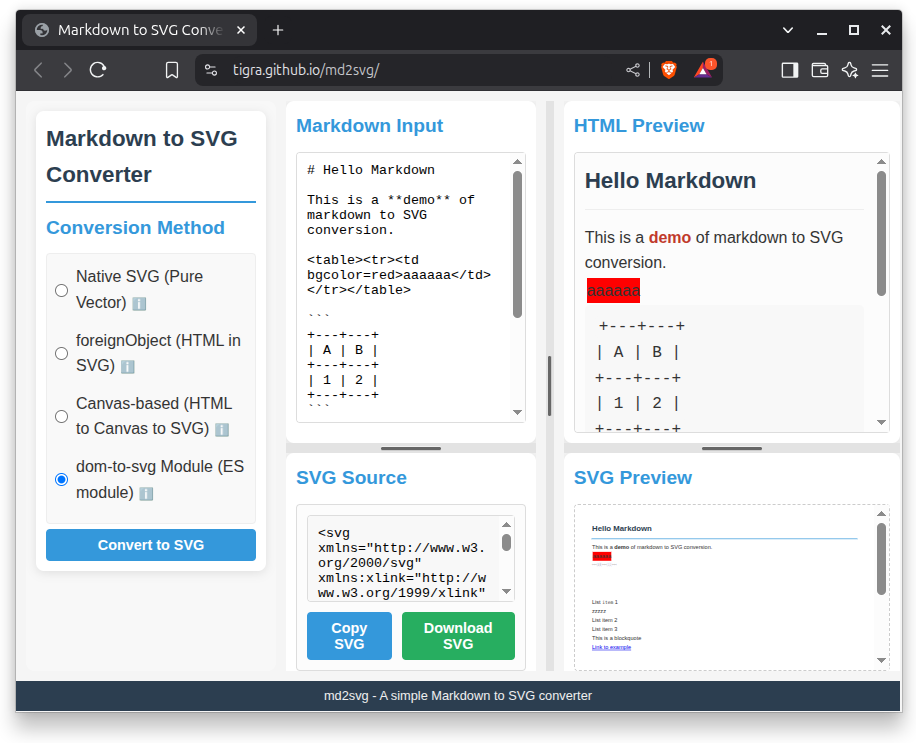

# md2svg

A tool for converting Markdown to SVG using multiple methods.

Built primarily to demonstrate different methods for Markdown -> SVG conversion. See `src/converters.js` for the essence of these methods.

## Features

- Convert Markdown text to SVG with four different methods:
  - **Native SVG** (pure vector with SVG elements, self-written - limited Markdown feature support, but genuine SVG)
  - **foreignObject** (HTML embedded in SVG)
  - **Canvas-based** (HTML rendered to canvas, then embedded in SVG as image) 
  - **dom-to-svg** Module (ES module based conversion, genuine SVG, feature-rich but not without issues)
- Live HTML preview
- Download generated SVG files
- Copy SVG code to clipboard
- Resizable panels using drag handles
- Detailed tooltips explaining each conversion method
- Responsive layout that works on various screen sizes

## Screenshots


## Usage

1. Open `index.html` in a web browser
   - For the dom-to-svg Module method, the page must be served via a web server due to ES module restrictions (http://localhost:3000 if run with `npm run dev`)
2. Enter or paste Markdown in the input area
3. Select your preferred conversion method:
   - **Native SVG**: Creates genuine vector SVG with pure SVG elements (text, lines, rectangles)
   - **foreignObject**: Embeds HTML directly in SVG using foreignObject
   - **Canvas-based**: Renders HTML to a canvas first, then embeds the result in SVG
   - **dom-to-svg Module**: Uses the dom-to-svg ES module for the most accurate SVG conversion
4. Click "Convert to SVG" to generate an SVG image
5. Use "Download SVG" to save the generated image or "Copy SVG" to copy the code to clipboard

## Implementation

This tool uses the following libraries:

- [Marked.js](https://marked.js.org/) - For Markdown parsing
- [DOMPurify](https://github.com/cure53/DOMPurify) - For HTML sanitization
- [html2canvas](https://html2canvas.hertzen.com/) - For HTML to canvas conversion (canvas method)
- [dom-to-svg](https://github.com/felixfbecker/dom-to-svg) - For DOM to SVG conversion (ES module)

## Architecture

The application follows a modular architecture with dependency injection:

### Module Structure
- `main.js` - Application entry point and UI management
- `converters.js` - Conversion methods for Markdown to SVG
- `resizers.js` - Panel resizing functionality
- `tooltips.js` - Tooltip management system

Each module uses a factory function pattern, allowing for:
- Explicit dependency injection
- Better testability
- Cleaner separation of concerns
- No reliance on global variables

## Conversion Methods

### 1. Native SVG (Pure Vector)
- Parses Markdown into tokens and maps each to pure SVG elements
- Headings → `<text>` elements with different font sizes
- Paragraphs → `<text>` elements with proper positioning
- Lists → `<text>` elements with bullet markers
- Blockquotes → `<text>` with decorative vertical line
- Inline formatting → `<tspan>` elements with styling
- 100% vector output with no HTML embedding
- Best for genuine vector SVG output compatible with all SVG tools

### 2. foreignObject Method
- Uses SVG's `<foreignObject>` element to embed HTML content
- Preserves all HTML structure and CSS styling
- Supports complex HTML that might be in the Markdown
- Best for HTML fidelity, but not supported by all SVG tools

### 3. Canvas-based Method
- Renders HTML to a canvas first using html2canvas
- Embeds the canvas output as an image in SVG
- Handles complex HTML including tables and embedded elements
- Best for visual fidelity and compatibility, but results in a raster image inside SVG

### 4. dom-to-svg Module Method
- Uses the dom-to-svg ES module library
- Most accurate DOM to SVG conversion
- Requires serving the page via a web server due to ES module restrictions
- Produces clean, semantically accurate SVG

## Browser Compatibility

- **Native SVG**: Works in all modern browsers, 100% vector output
- **foreignObject**: Works in modern browsers but compatibility with SVG tools varies
- **Canvas-based**: Works in all modern browsers, most compatible but embeds a raster image
- **dom-to-svg Module**: Requires ES module support and serving via a web server

## UI Features

### Resizable Panels
- Horizontal resizing between columns
- Vertical resizing within columns
- Maintains minimum sizes for usability
- Grid-based responsive layout

### Smart Tooltips
- Context-sensitive tooltips for conversion methods
- Smart positioning based on available screen space
- Tooltips remain visible even when parent containers have overflow:hidden

## Development

### Local Development Server

This project uses Vite for development and building. To start the development server:

```bash
# Install dependencies
npm install

# Start development server
npm run dev
```

This will start a development server at http://localhost:3000 with hot module replacement.

### Building for Production

To build the application for production:

```bash
# Build the project
npm run build
```

This will create a `dist` directory with the bundled application.

### Preview Production Build

To preview the production build locally:

```bash
# Preview the production build
npm run preview
```

### GitHub Pages Deployment

This project is configured for manual deployment to GitHub Pages through GitHub Actions:

1. Go to your GitHub repository
2. Navigate to the "Actions" tab
3. Select the "Deploy to GitHub Pages" workflow
4. Click "Run workflow" and select the branch you want to deploy

This manual approach gives you control over when to deploy new versions.

After deployment, the application will be available at: https://yourusername.github.io/md2svg/

> **Note:** The repository includes a screenshot image (`md2svg.png`) in the public directory that will automatically be deployed to GitHub Pages.

## Future Enhancement Areas

Potential areas for improvement:
- Better support for tables and complex Markdown elements
- Add options to control SVG dimensions and styling
- Create a Node.js CLI version for server-side generation
- Add proper bundling with Webpack or another tool to avoid ES module issues
- Improve error handling and fallback options for each method
